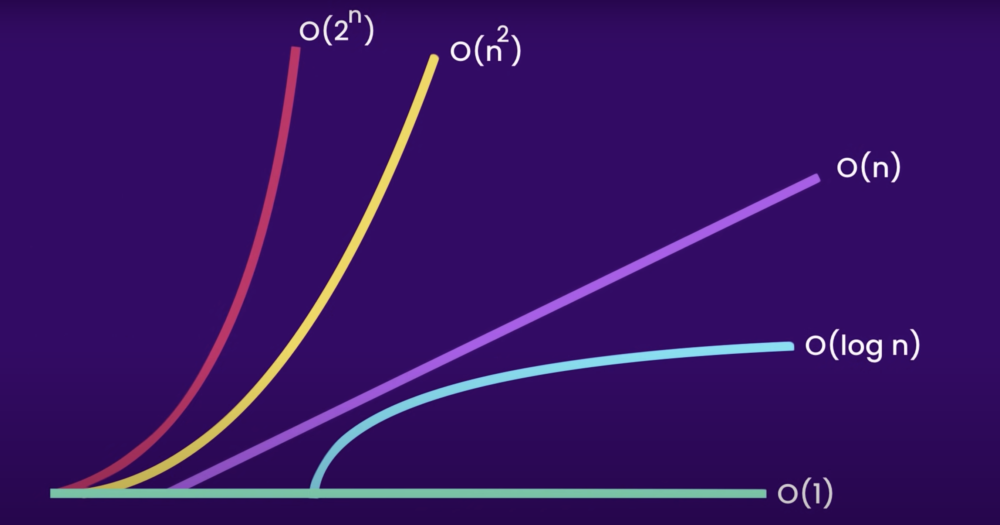

# Big O Notation

[Big O notation](https://en.wikipedia.org/wiki/Big_O_notation) is used to classify algorithms according to how their run time or space requirements grow as the input size grows.

## Learning Objectives

- Understand how to use Big O to describe both the time and space complexity of an algorithm
- Understand how Big O notation describes how an algorithm scales, e.g. if an algorithm works with an input that has one hundred pieces of data, how will it perform with an input that has one million pieces of data?
- Understand how to calculate Big O notation
- Use Big O notation to describe the time and space complexity of different sort algorithms
- Implement different _sort_ algorithms
- Understand the relation of Big O to the actual performance of different sort algorithms

## Big O

Big O notation is used to classify algorithms (or functions or algorithms) according to how their _time_ or _space_ requirements grow dependent on their _input_.

Big O characterises functions according to their growth rates. Suppose we have functions _x_ and _y_ that perform completely different tasks -  if they have the same growth rate (in respect to time and space), then they will be represented using the same Big O notation (the letter O is used because the growth rate of a function is also referred to as the order of the function).

Figure 1, below, shows some commonly used Big O classifications:



_Figure 1: Big O, where O(1) is the most efficient, and O(2<sup>n</sup>) the least_

- O(1) - the growth is constant, no matter the input. 
- O(log n) - logarithmic growth
- O(n) - linear growth
- O(n<sup>2</sup>) - quadratic growth
- O(2<sup>n</sup>) - exponential growth

## Space Complexity

The [space complexity](https://en.wikipedia.org/wiki/Space_complexity) of an algorithm is the amount of memory it requires.

- O(1) - the algorithm uses a fixed (small) amount of space, irrespective of the input. For example:

```js
const tripler = (a, b, c) => {
   const x = a * b * c;
   return x;
}
```

No matter what numbers are given to `tripler`, it will _always_ use the same amount of space because [javascript numbers are always 64-bit floating point](https://www.w3schools.com/js/js_numbers.asp). Hence, `tripler` has space complexity of O(1).

- O(log n), O(n), O(n<sup>2</sup>) O(2<sup>n</sup>) - these indicate that the algorithm needs additional space based on the length of the input. For example:

```js
const copier = (q) {
    const copiedQ = queue();
    let front = q.front;
    while (front) {
        copiedQ.enQueue(front.data);
        front = front.next;
    }
}
```

The function `copier` creates a copy of the `queue` _q_. Hence, it takes O(n) space as you create _n_ additional queued nodes (where _n_ describes the length of _q_, which can vary).

## Time Complexity

The [time complexity](https://en.wikipedia.org/wiki/Time_complexity) of an algorithm is the amount of time it takes to run.

- O(1) - the algorithm uses a fixed (small) amount of time, irrespective of the input. For example:

```js
const logger = (input) => {
    console.log(input)
}
```

The function `logger` will always run a single `console.log`, no mater what the input. Hence, it has _time_ complexity of O(1).

- O(log n), O(n), O(n<sup>2</sup>) O(2<sup>n</sup>) - these indicate that the algorithm needs additional time based on the length of the input. For example:

```js
const sum = (stack) => {
    let total = 0;
    let top = stack.pop();
    while (top) {
        total += top.data;
        top = stack.pop();
    }
}
```

The function `sum` sums all the numbers on the `stack`. Hence, it takes O(n) time as you process _n_ additional stacked nodes (where _n_ describes the length of the `stack`, which can vary).

```js
const orderedPairs(list)
{
    for (let i = 0; i < list.size; i++)
    {
        for (let j = 0; j < list.size; j++)
        {
            console.log("pair", list[i], list[j]);
        }
     }
}
```

The function `orderedPairs` runs in O(n<sup>2</sup>) time (quadratic time), because the array has _n_ items, so the outer loop runs _n_ times and the inner loop runs _n_ times for each iteration of the outer loop, giving us n<sup>2</sup> total runs of `console.log`.

```js
const fibonacci = (num) => {
  if (num <= 1) return num;
  return fibonacci(num - 2) + fibonacci(num - 1);
}
```

The [recursive](https://www.cs.utah.edu/~germain/PPS/Topics/recursion.html) function `fibonacci` has a time complexity of O(2<sup>n</sup>) (exponential time) because it's run time doubles as the input grows by 1.

## Calculating Big O

When calculating complexity, throw away the constants and the least significant terms. Additionally, when summarising algorithms, only consider the _worst case_ scenario.

Consider this:

```js
const loopLogger = (input) => {
    const mySize = 100;
    for (let i = 0; i < mySize; i++) {
        console.log(i)
    }

    for (let i = mySize - 1; i >= 0; i--) {
        console.log(i)
    }
}
```

`loopLogger` is O(2n), which is just O(n) because the graph of `2n` is still a straight line (so we have linear growth).

```js
const anotherLogger = (list)
{
    console.log("First element", list[0]);

    for (int i = 1; i < list.size / 2; i++) {
        console.log("First half", list[i]);
    }

    for (int i = 100; i > 0; i--) {
        console.log("Countdown", i;
    }
}
```

`anotherLogger` has time complexity that is just O(n) (linear), not O(1 + n/2 + 100), because again, if you were to graph `1 + n/2 + 100`, you'd get a straight line.

```js
const logThenSumPairs = (list) => {

    for (let i = 0; i < list.size; i++) {
        console.log(i)
    }

    for (let i = 0; i < list.size; i++) {
        for (let j = 0; j < list.size; j++) {
            console.log("sum", list[i] + list[j]);
        }
     }
}
```

The time complexity of `logThenSumPairs` is not O(n + n<sup>2</sup>), because we drop the least significant term, _n_. Hence, we have O(n<sup>2</sup>).

```js
const isIn = (list, item) => {
    for (let i = 0; i < list.size; i++) {
        if (list[i] === item) return true;
    }
    return false;
}
```

If `isIn` is lucky, the _item_ is **always** the first element of the _list_, so it would have O(1) time complexity. However, if it is unlucky, the _item_ will be in the last position, so it would have O(n) complexity. When generalising, it is this _worst case_ you should consider - hence, the time complexity of `isIn` is O(n).

However, it is valid to _be specific_, too, and say that `isIn` has _worst case_ complexity of O(n), and _best case_ O(1), and thus infer some _average case_. Indeed, for some algorithms we can also make rigorous statements about their _average case_ runtime. We will consider some of those later in the course.

## Exercise

1. Fork this repository and clone the fork to your machine
2. Run `npm ci` to install project dependencies
3. Implement each of the empty _sort_ functions inside the [src](./src) directory
    - Add a commment to each function implementation that describes:
        1. Conceptually, how the sort algorithm works. You _may_ wish to write this _first_, then try and implement your conceptual understanding
        2. The time and space complexity in Big O notation. Why does the function have that complexity?
4. Run `npm run test` to test your code
5. Add timing results for each of your sorting algorithms into the file [sortResults.md](docs/sortResults.md) (tip: `performance.now()` might be useful here, see: https://developer.mozilla.org/en-US/docs/Web/API/Performance/now). Which ran fastest? And slowest? Given your understanding of Big O complexity of the different sorting algorithms, described in Step 3., above, were those results what you expected? If not, why not? Add that summary to the file, too
