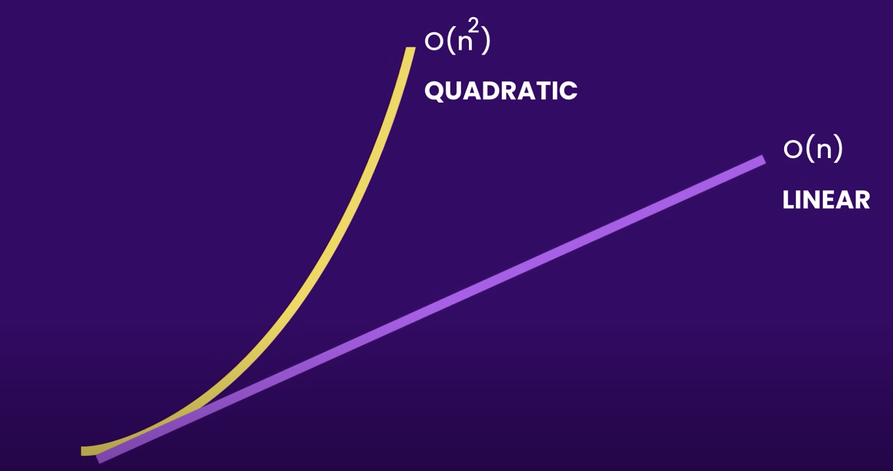

# O(n²)

```
const people = [
	{ name: "Rico", likes: ["pirates", "bandanas"] },
	{ name: "Nathan", likes: ["shadows", "bass guitars"] },
	{ name: "Ed", likes: ["skiing", "doggos"] }
]

function displayLikes(people) {
	for (let i = 0; i < people.length; i++) {
		const person = people[i]

		console.log(`${person.name} likes: `)

		for (let j = 0; j < person.likes; j++) {
			const thing = person.likes[j]

			console.log(`${j + 1} - ${thing} `)
		}
	}
}

displayLikes(people)
//=> Rico likes:
//=> 1 - pirates
//=> 2 - bandanas
//=> Nathan likes:
//=> 1 - shadows
//=> 2 - bass guitars
//=> Ed likes:
//=> 1 - skiing
//=> 2 - doggos
```

## Key points

- In `O(n²)` the `n` represents the size of the input
- The algorithm runs in correlation with the input and the size of the nested loop
- The runtime complexity is `O(n²)` where the size of each loops matter
- The algorithm runs in quadratic time

## Quadratic vs Linear Performance



## Real World Examples
