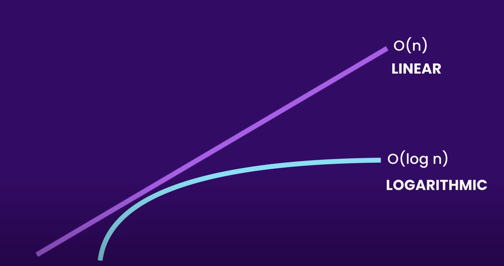

# O(log n)

[Back](../../README.md)

## Key points

- In `O(log n)` the `n` represents the size of the input
- The algorithm runs in correlation with the input and the size of the nested loop
- The runtime complexity is `O(n²)` where the size of each loops matter
- The algorithm runs in quadratic time

## Logarithmic vs Linear Performance



### Linear Search - O(n)

The aim is to find the number 8.
The time complexity of this algorithm is `O(n)`.
The algorithm goes through each element of the array until it finds the number 8.

```
const nums = [1, 2, 3, 4, 5, 6, 7, 8, 9, 10]

function linearSearch(nums) {
	for (let i = 0; i < nums.length; i++) {
		const num = nums[i]

		if (num === 8) return num
	}
}

linearSearch(nums)
//=> 8
```

### Binary Search - O(log n)

The aim is to find the number 8.
The time complexity of this algorithm is `O(log n)`.
The algorithm halves the input at each step, reducing the work by half, until it finds the number 8.

```
const nums = [1, 2, 3, 4, 5, 6, 7, 8, 9, 10]

function binarySearch(array, query) {
  const midPoint = Math.floor(array.length / 2);

  if (array[midPoint] === query) {
    return array[midPoint];
  }

  if (array[midPoint] < query) {
    const subArray = array.slice(midPoint, array.length);

    return binarySearch(subArray, query);
  }

  if (array[midPoint] > query) {
    const subArray = array.slice(0, midPoint);

    return binarySearch(subArray, query);
  }
}

binarySearch(nums, 8)
//=> 8
```

## Real World Examples
